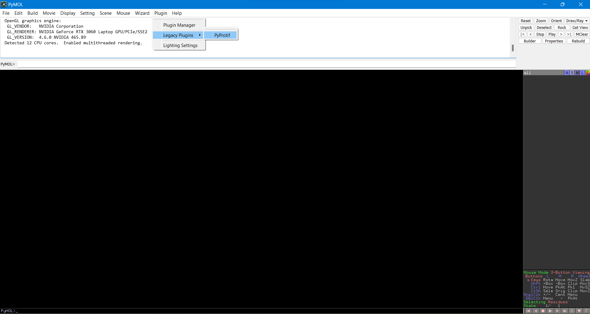
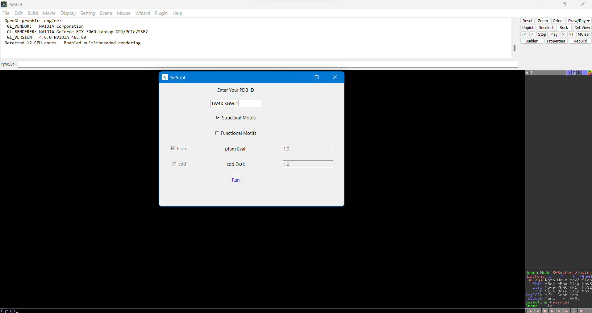

# PyProtif Tutorial

After installing the PyProtif plugin through the PyMOL's plugin manager (following the installation instructions provided in the README.md file), you can launch the plugin by navigating to the `'Legacy Plugins'` under the `'Plugin'` menu in PyMOL (see figure below). In this menu, you will find the PyProtif plugin along with other installed plugins. However, make sure that the option to load the plugin on startup is selected.



<br>For the example below, we have used two proteins from the Baeyer-Villiger monooxygenase (BVMO) protein family: Cyclohexanone Monooxygenase (CHMO, PDB code 3GWD) and Phenylacetone Monooxygenase (PAMO, PDB code 1W4X).

---

### Retrieve multiple entries

The PyProtif plugin allows users to study simultaneously multiple proteins and to select and manipulate each motif separately through its expandable menu and user-friendly interface. Users have the option to fetch the structural and/or functional motifs either individually by specifying the corresponding PDB ID of the protein of interest, or collectively by specifying multiple PDB IDs separated by a space (as observed in the figure below).



After clicking the `'Run'` button, the plugin will automatically 

1. fetch the 3D structures for the two proteins of interest from the Protein Data Bank and load them in PyMOL viewer, in the default representation settings.

2. retrieve their structural motifs from the PDBsum, 

3. generate summary output windows of these motifs for each valid PDB ID,

4. create an extensively organized and expandable menu of objects (down to every motif itself) within PyMOL object control panel, allowing users to easily control and manipulate these motifs.


---

### Clean and Superimpose the two proteins

For the purpose of this tutorial, the two retrieved PDB structures were cleaned to retain solely the protein macromolecules by removing the ligands, cofactors and water molecules. This was achieved by executing the following command in PyMOL:

```
remove not pol
```

Next, to perform a comparative analysis of the overall architecture of the two proteins, with a particular focus on β-bulges (which are localized disruptions of the regular hydrogen bonding of β-sheet due to the insertion of extra residues into one or both hydrogen-bonded β-strands), a structural superposition was carried out using the `'cealign'` method which is already integrated within PyMOL. This was achieved by executing the below command with a resulting Cα RMSD score of 2.7 Å between the two proteins.

```
cealign 1w4x, 3gwd
```


---

### Make publication quality figures

In the final step, the proteins and the specific motifs of interest are colored according to personal preferences and rendering settings are applied in order to generate high-quality figures suitable for publication. On the right side panel, the plugin organizes the various retrieved motifs in an expandable menu with an intuitive naming, allowing users to recognize and manipulate the specific motif(s) they are interested in.

For a list of color values in PyMOL, please refer to [Color Values - PyMOLWiki](https://pymolwiki.org/index.php/Color_Values). 

In order to obtain the rendering depicted in the figure below, execute the following statements in the command input area of PyMOL. 

```
bg_color white
color grey90, 1W4X
color bluewhite, 3GWD
color gold, 1w4x.A.beta_bulges
color hotpink, 3gwd.A.beta_bulges
set cartoon_fancy_helices, 1
set depth_cue, 0
set orthoscopic, 1
```


To showcase both proteins side by side, while preserving the same orientation obtained from the superposition, activate the objects 1W4X and 3GWD exclusively then execute the command `set grid_mode, 1` to display them in a grid layout. You can also do it manually by:

1. moving the superimposed proteins to one side (left or right) of the PyMOL viewer,

2. changing the mouse mode from `viewing` to `editing` in the bottom right of PyMOL window,

3. dragging one of the proteins to the opposite side of the viewer by clicking the `middle mouse` button while holding down the `Shift` key.


Lastly, adjust the size and position of the output windows that display the summary of the structural motifs for each protein, and proceed to save the figure.
